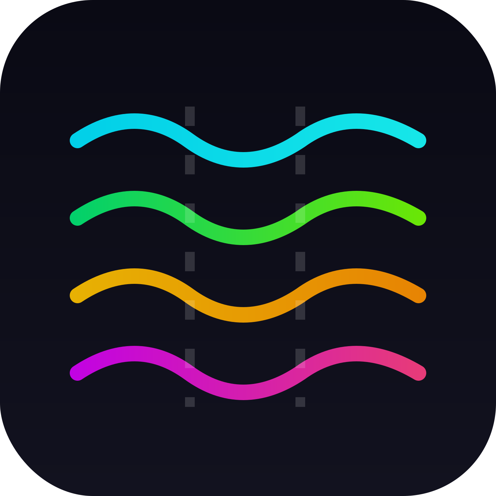

#  Skwad

A frequency coordinator for FPV drone pilots. When multiple pilots fly together, everyone needs to be on a different video channel to avoid interference. Skwad handles the channel math so pilots can scan a QR code, enter their gear info, and get told which channel to use.

## The Problem

FPV video transmitters share the 5.8 GHz band, but different systems (analog, DJI, HDZero, Walksnail) have different channel tables with different center frequencies and signal widths. A DJI O3 running at 40 MHz bandwidth takes up twice the spectrum of a 20 MHz analog transmitter. You can't just "stay two channels apart" because the channels aren't evenly spaced and the signals aren't the same width.

## Running It

### Docker

```sh
docker build -t skwad .
docker run -p 8080:8080 -v skwad-data:/data skwad
```

### From Source

Requires Go 1.24+.

```sh
go build -o skwad .
DB_PATH=./skwad.db ./skwad
```

The server starts on port 8080 by default. Set `PORT`, `DB_PATH`, and `STATIC_DIR` environment variables to override defaults.

## Supported Video Systems

| System | Channels | Bandwidth | Notes |
|--------|----------|-----------|-------|
| **Analog 5.8 GHz** | R1–R8 (Race Band) | 20 MHz | 5658–5917 MHz |
| **HDZero** | R1–R8 (Race Band) | 20 MHz | Same frequencies as analog |
| **DJI V1 / Vista** | 4 stock, 8 FCC | 20 MHz | Different center frequencies than Race Band |
| **DJI O3** | 3 stock, 7 FCC (20 MHz); 1 ch at 40 MHz | 20/40 MHz | 40 MHz: single channel at 5795 MHz |
| **DJI O4 / O4 Pro** | 3 stock, 7 FCC (20 MHz); 1–3 at 40 MHz; 1 at 60 MHz | 20/40/60 MHz | Race Mode (Goggles 3/N3) uses Race Band |
| **Walksnail Avatar** | Standard (same as DJI V1) or Race Mode (Race Band) | 20 MHz | FCC unlock applies to standard mode |
| **OpenIPC** | WiFi-165 | 20 MHz | Single channel at 5825 MHz |

Available channels depend on the pilot's settings: FCC unlock status, which goggles they use (for DJI O4 Race Mode), and their bandwidth setting. See [fpv-optimizer.md](fpv-optimizer.md) for the complete channel tables.

## How Spacing Works

The optimizer doesn't use a single fixed spacing number. It calculates the required separation for each pair of pilots based on their actual signal widths.

**Occupied bandwidth** is how wide the signal actually is:
- Analog, HDZero, DJI V1, Walksnail: **20 MHz**
- DJI O3/O4 at 20 MHz setting: **20 MHz**
- DJI O3/O4 at 40 MHz setting: **40 MHz**
- DJI O4 at 60 MHz setting: **60 MHz**

**Required spacing** between two pilots:

```
(pilot A bandwidth / 2) + (pilot B bandwidth / 2) + 10 MHz guard band
```

Examples:
- Two analog pilots (20 + 20): need **30 MHz** center-to-center
- Analog next to DJI O3 at 40 MHz (20 + 40): need **40 MHz** center-to-center
- Two DJI O4 at 40 MHz (40 + 40): need **50 MHz** center-to-center
- DJI O4 at 60 MHz next to analog (60 + 20): need **50 MHz** center-to-center

The 10 MHz guard band provides a safety margin beyond the signal edges.

For a deeper dive into the optimization logic, frequency tables, and conflict detection, see [fpv-optimizer.md](fpv-optimizer.md).

## How the Optimizer Works

The optimizer runs every time a pilot joins, leaves, or changes their channel preference. It works in three steps:

### Step 1: Lock in fixed-channel pilots

Some pilots can't change channels — their VTX is set and they don't want to change it, or their system only has one channel option (like DJI O3 at 40 MHz). These get placed first, exactly where they requested.

### Step 2: Assign flexible pilots, most constrained first

Remaining pilots are sorted by how many channels they have available — fewest options first. A DJI O3 stock pilot with 3 channels gets assigned before an analog pilot with 8 channels, because the analog pilot has more fallback options.

For each pilot, the optimizer tries every channel in their pool and picks the one with the best **margin** — the gap between actual center-to-center separation and the required spacing. Higher margin = less chance of interference.

**Stability preference:** If a pilot was already on a channel and it still has non-negative margin, the optimizer keeps them there rather than shuffling everyone around. This prevents unnecessary channel changes when a new pilot joins.

### Step 3: Buddy groups

If there are more pilots than available channels (e.g., four DJI O3 stock pilots but only three O3 channels), some pilots have to share a frequency. The optimizer marks these as a "buddy group" — they can still fly, but need to take turns or accept interference. The UI highlights buddy groups with matching colored borders and "SHARING WITH" labels.

## Conflict Detection

After optimization, Skwad checks every pair of pilots for conflicts:

- **Danger** (red): Signals actually overlap — center-to-center separation is less than the sum of half-bandwidths. Definite interference.
- **Warning** (amber): Separation is less than the required spacing but signals don't overlap. Interference is likely, especially with reflections and multipath.

Conflicts appear on pilot cards showing actual separation vs. required (e.g., "OVERLAP WAYNE (26/40 MHz)").

## User Workflows

### Starting a Session

1. One pilot taps **START SESSION** — gets a 6-character code
2. They share the code or QR code with the group
3. Other pilots scan the QR or enter the code to join

### Joining a Session

1. Enter your callsign
2. Pick your video system (Analog, DJI V1, DJI O3, DJI O4, HDZero, Walksnail, OpenIPC)
3. Answer follow-up questions based on your system:
   - FCC unlocked? (DJI V1, O3, O4, Walksnail Standard)
   - Which goggles? (DJI O4)
   - Bandwidth? (DJI O3, O4)
   - Race Mode? (DJI O4 with Goggles 3/N3, Walksnail)
4. Choose channel preference: **auto-assign** (recommended) or **lock to a specific channel**
5. Hit JOIN — you get your optimized channel assignment

### Displacement Preview

If joining or changing channels would move existing pilots, a confirmation dialog shows each affected pilot and where they'd move:

- **MOVE EVERYONE** — full rebalance, applies the optimizer's ideal assignments for all pilots
- **JUST MOVE ME** — only applies your new assignment, leaves everyone else where they are (hidden for danger-level conflicts)
- **CANCEL** — back out, nothing changes

### Channel Change Notification

If someone else's join moves your channel, you see a banner showing the change so you can coordinate with your group before switching your VTX.

### Managing Your Session

- **Tap your own card** to change channel, change video system, change callsign, or leave
- **Tap another pilot's card** to remove them (slide-to-confirm prevents accidental removal)
- **Tap the session code** for a fullscreen QR code

### Spectrum Visualization

The session footer shows a spectrum visualization of the 5.8 GHz band (5640–5930 MHz). Each pilot appears as a bell-curve waveform whose width represents their occupied bandwidth. Colors indicate status: green (you), red (danger), orange (warning), gray (clear).

### Live Updates

Clients poll for changes every 5 seconds. Any pilot joining, leaving, or changing channels automatically updates all connected clients.

## Project Structure

```
skwad/
  main.go           # HTTP server and routing
  freq/
    tables.go       # Channel tables for all video systems
    optimizer.go    # Frequency assignment algorithm
  api/
    handlers.go     # API endpoint handlers
  db/
    db.go           # SQLite database layer
  static/
    index.html      # Single-page app
    app.js          # Client-side logic
    style.css       # Styles
```

## API

| Method | Endpoint | Description |
|--------|----------|-------------|
| `POST` | `/api/sessions` | Create a new session |
| `GET` | `/api/sessions/{code}` | Get session state |
| `POST` | `/api/sessions/{code}/join` | Join a session |
| `POST` | `/api/sessions/{code}/preview-join` | Preview join (dry run) |
| `GET` | `/api/sessions/{code}/poll` | Long-poll for changes |
| `POST` | `/api/pilots/{id}/preview-channel?session=CODE` | Preview channel change |
| `PUT` | `/api/pilots/{id}/channel?session=CODE` | Change channel |
| `PUT` | `/api/pilots/{id}/callsign?session=CODE` | Change callsign |
| `DELETE` | `/api/pilots/{id}?session=CODE` | Remove pilot |

Join and channel change endpoints support `?rebalance=false` to skip the full optimizer rebalance (used by "JUST MOVE ME").

## Tech Stack

- **Backend:** Go 1.24, net/http (stdlib router), SQLite via [modernc.org/sqlite](https://pkg.go.dev/modernc.org/sqlite) (pure Go, no CGO)
- **Frontend:** Vanilla HTML/CSS/JS, no build step, installable as a PWA
- **Database:** SQLite with WAL mode

## License

Apache License 2.0. See [LICENSE](LICENSE).
